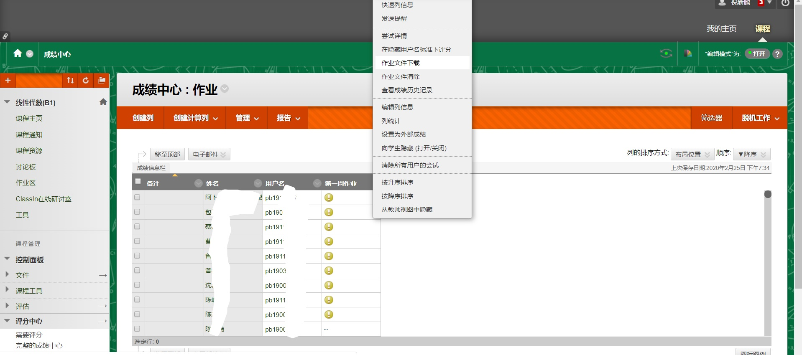
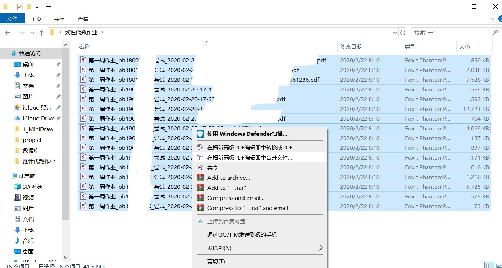

# 助教批改作业方法
#### 描述
在疫情期间，中国科学技术大学使用[blackboard](https://www.bb.ustc.edu.cn/)系统开展线上教学。

作为一个助教，设计了一套较为方便本地批改作业的方法，在这里分享，欢迎其它同学改进。

使用本地批改，主要是因为线上平台延时较高，在本地合并为一个pdf批改可以最大程度减少加载延时。

需要脚本是因为网页只提供批量下载功能，需要解决以下问题：
- 哪些作业是新交的，哪些是批改过的。
- 哪些作业是我需要批改的，哪些是其它助教需要批改的。
- 课程名单变化很快，手动维护一份同学名单较为困难。
- 快速根据作业在记录表中找到对应的行。
  
#### 步骤
1. 在[blackboard](https://www.bb.ustc.edu.cn/)批量下载本次作业的最新版本。

2. 将下载得到的文件解压入一个文件夹（如"第一次作业"解压到文件夹"一"）
3. 根据文件夹名修改myselect.py的全局变量（本例子文件夹名为"一",作业名为"第一次作业"），执行myselect.py。
4. 使用学习的福昕pdf编辑器将"一"文件夹中剩余的文件按名称升序合并为一个pdf。

5. 打开"作业一.csv",按照顺序记录成绩，在comment栏记录错题。
6. 若需要批改新交上来的作业，删除文件夹一，重复1-5即可。（myselect.py会删除下载的作业中已经批改过的，并在"作业一.csv"内增加新交上来的作业项。）
7. 公布成绩，可以将"作业一.csv"发到QQ群中，将成绩批量复制粘贴到BB系统。

#### 脚本作用
myselect.py
- 删除非作业文件
- 删除已经批改过的作业
- 删除应该由其它助教批改的作业
- 按顺序将新交上来的作业项插入记录作业成绩的csv文件